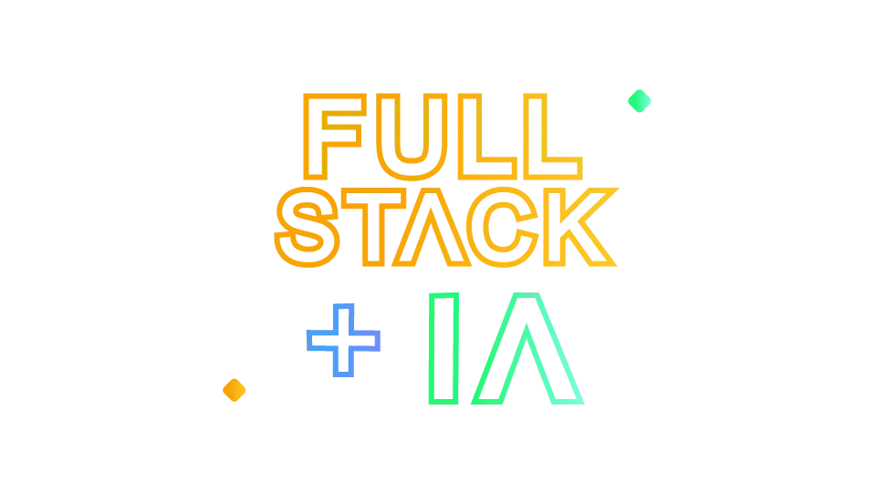

# 🧑‍💻 Portfolio

<div align="center">



<div data-badges>
    
    
    
</div>

<div data-badges>
  
    
    
    
    
    
    
    
</div>

</div>

Portfolio is a full-stack application that brings together widely used technologies to showcase a developer’s skills and projects. More than a display of past work, it serves as a practical demonstration of the developer’s technical abilities and experience with modern web development.
The application also includes AI agents with access to the developer’s résumé, GitHub repositories, and professional history. Through real-time chat, recruiters and potential clients can ask about specific technical skills and projects and receive detailed answers. These conversations make it easier to explore the developer’s experience and assess how it relates to their needs.
## 🖥️ How to Run This Project

### Requirements

- Node.js installed

### Steps

1. Clone the repository:

   ```sh
   git clone https://github.com/wgaboardi/portfolio.git
   ```

2. Open the project directory:

   ```sh
   cd portfolio
   ```

3. Sign in to [Supabase](https://supabase.com), or create an account.

4. Open your Supabase project and click **Connect**.

5. Select **ORM**, then choose **Prisma**.

6. Copy the environment variables provided by Supabase. Create a `.env` file in the `backend` directory:

   ```env
   DATABASE_URL=
   DIRECT_URL=
   PORT=
   ```

   If `PORT` is not set, the backend runs on port `4000` by default.

7. Create an account at [n8n](https://n8n.io) and import the `assistente-pessoal` workflow from the `assets` directory.

8. Open the first node of the imported workflow. Under **Webhook URLs**, select **Production URL** and copy the URL. Activate the workflow in n8n.

9. Create a `.env` file in the `web` directory. Set the API URL to your backend URL and the chat webhook to the production URL copied from n8n:

   ```env
   NEXT_PUBLIC_API_URL=
   NEXT_PUBLIC_CHAT_WEBHOOK=
   ```

10. Run `npm i` in both the `web` and `backend` directories to install their dependencies.

11. Open `web` and `backend` in separate terminals. Run `npm run dev` in each terminal to start the project.

## 🗒️ Project Features

- Project showcase
- Chat integration with AI agents
- Integrated GitHub repositories
- Featured technologies
- Technologies used in each project
- Project lookup by ID, including associated technologies

## 💎 Links 💎

-   [Next.js](https://nextjs.org/docs)
-   [NestJS](https://docs.nestjs.com/)
-   [N8N](https://n8n.io/)
-   [Prisma](https://www.prisma.io/docs)
-   [Supabase](https://supabase.com)
